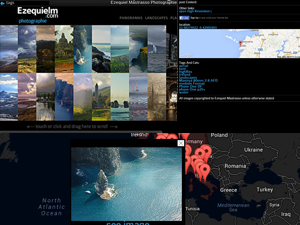

EzequielM-WP-Theme
==================

This is a php js bootstrap iscroll python googleMaps api and xml based theme for Wordpress. Designed for any image driven blogin' experience.

[photos.ezequielm.com](http://photos.ezequielm.com) wordpress theme. Read below for all the Features and roadmap!

You can check the theme at work [**Here**](http://photos.ezequielm.com) 

The theme features:
------------------
* mobile and touch compatible
* auto size and adjustments for desktop, tablet and mobiles
* touch/click drag the thumbnails to scroll (desktop and mobile compatible)
* top menu plugin for main categories and pages
* select website styles, and google maps styles!
* customize layout with up to up to 5 columns or rows, image size and padding
* top fixed bar for important information, related links, or even adds
* left off-canvas column for categories links and tags built from a menu
* custom fields for:
  1. gps Coords
  2. thumbnails
  3. midRes
  4. HighRes (using krPano, 1 file or pano tiled multires, etc)
  6. facebook thumbnails
  7. facebook likes and shares
*exif info taken from images
* copyrights, license and photo info credits

HELP NEEDED:
------------
After failing to find a nice image driven theme for wordpress to show my photos that would not look like every other theme. I started doing my own. Quickly it grew up into quite big enough project, with lots of features added over a period of one year and a half.
Now, I'm planning to extend it and making it more flexible for people to use it and customize, keeping it openSource, while retaining the original idea of the image driven blogging.

Write to ezequielm at gmail dot com if you feel like contributing

Looking forward to hear from you!

To do:
------
* general House Keeping
* color theme files for site and map
* make gigapan category to use a free flash highRes viewer similar to krPano
* automatically generate left column from categories parents as in
  parentCat1Link: linkToCat,  linkToCat2, linkToCat3
  parentCat2Link: linkToCat4, linkToCat5, linkToCat6
* get css controls from inside wp-admin panel theme editor for:
  1. scroll iframe size (currently fixed size)
* bring comments back to the theme
* and probably a lot more

Quick setup on a existing wordpress:
--------------------------
Compatible with wordpress 3 to 3.9 and php versions 3 to 5.x

1. copy this entire repo to your wordpress folder
2. desired, create a new database for your wordpress photo blog
3. login to your wp-admin
4. go to themes and select the Eze theme
5. go to eze settings, and click on every save changes in the page to force the site and admin Options into the DB.
6. read below "testing" to quickly setup 1 image and view the theme.

Quick start up for coding on local environment:
--------------------------
Compatible with wordpress 3 to 3.9 and php versions 3 to 5.x

1. Install apache, mySql, php, and phpMyAdmin
2. activate apache's modRewrite module
3. change you home dir configuration (ie: /var/www/html) from override None to override All
4. if you are in a RedHat based distro (redhat, centos, or fedora), either configure SELinux properly or disable it.
4. copy this entire repo to your www root
5. from your ../wwwRootFolder do chown -R apache * to transfer the files ownership to the apache user. This will avoid wordpress to ask for an ftp password and having to setup an ftp server when uploading files or installing plugins
5. chown apache -r
4. set permissions as stated in wordpress codex
5. create your database in utf8-unicode
6. modify the wp-config.php to include you DB name, username, password, host, 
7. login to your wp-admin
8. go to eze settings, and click on every save changes in the page to force the site and admin Options into the DB.

Testing:
--------

ca-dirtCart.jpg is supplied for testing purposes

1. create a post with a test title, and add "ca-dirtCart.jpg" (without quotes) to the small img, midRes, and highRes images. Set the lat and long coords to 13.61117537 and 106.49906158
8. create a second, a third and a forth post, with the same information.
9. open you http://localhost to see the them working
10. click on any of the images
11. When inside the post, click on the mid resolution image to see the left panel sliding in with the photo info, post content, highResolution link, gps coords with google maps thumbnail, and tags/categories the photo is included in.
12. You can also open http://localhost/world-map to see the picture tagged with a marker inside the map, click on it to see the facebook thumbnail, and click on the thumbnail to go to the post.

